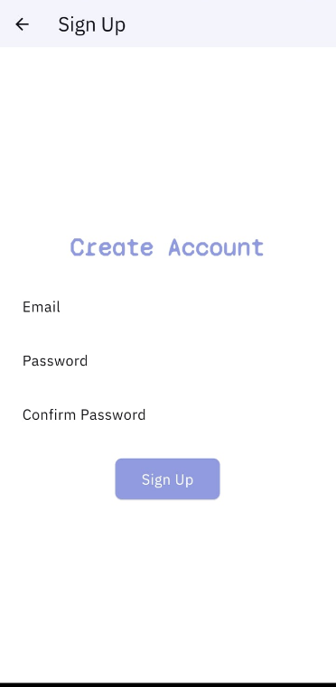
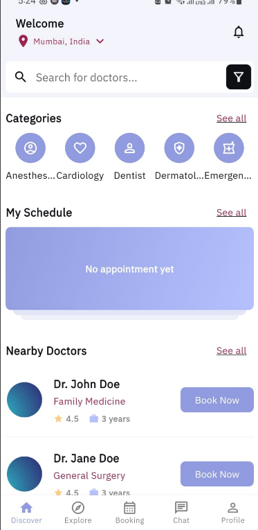
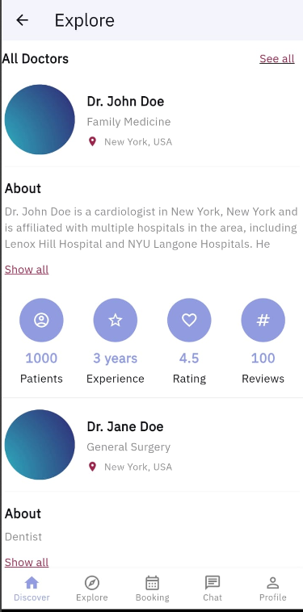
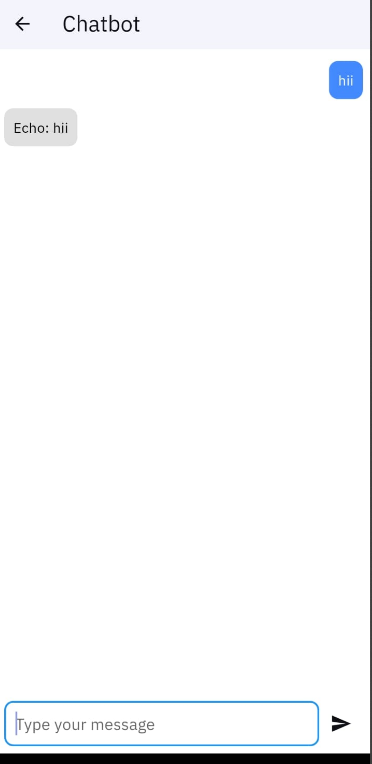

# DocFinder: A Doctor Booking App

<table>
  <tr>
    <td></td>
    <td>
      <strong>DocFinder</strong> is a doctor booking app template built by <a href="https://atomsbox.com">atomsbox.com</a>. It gives you a modern UI to handle the process of scheduling and managing appointments for both patients and healthcare providers. This template is a starting point for developers looking to create a doctor booking app without building everything from scratch.
    </td>
  </tr>
</table>

## App Screenshots

Here are some screenshots of the app:
<table>
  <tr>
    <td style="padding-bottom: 20px;"></td>    
  </tr>
  <tr>
    <td style="padding-bottom: 20px;"></td>    
  </tr>
  <tr>
    <td style="padding-bottom: 20px;"></td>
  </tr>
  <tr>
    <td style="padding-bottom: 20px;"></td>
  </tr>
  <tr>
    <td></td>
  </tr>
</table>

