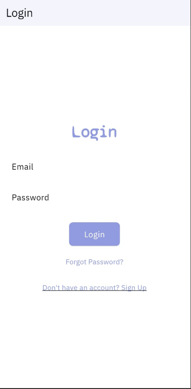

# DocFinder: A Doctor Booking App

<table>
  <tr>
    <td></td>
    <td>

DocFinder is a cutting-edge doctor booking app powered by Flutter and crafted by atomsbox.com. It empowers users to discover nearby doctors based on their specialties, enabling seamless communication through in-app chat functionalities. With DocFinder, users can effortlessly schedule appointments, manage their healthcare needs, and experience a modern UI designed for both patients and healthcare providers. This template serves as an ideal starting point for developers seeking to create a robust doctor booking app without starting from scratch.
    </td>
  </tr>
</table>

## App Screenshots

Here are some screenshots of the app:

<table>
  <tr>
    <td style="padding: 10px;"></td>
     <tr>
    <td colspan="2" style="width: 40px;"></td> <!-- Empty row for vertical space -->
  </tr>
    <td style="padding: 10px;"></td>    
  </tr>
  <tr>
    <td colspan="2" style="height: 40px;"></td> <!-- Empty row for vertical space -->
  </tr>
  <tr>
    <td style="padding: 10px;"></td>
     <tr>
    <td colspan="2" style="width: 40px;"></td> <!-- Empty row for vertical space -->
  </tr>
    <td style="padding: 10px;"></td>
  </tr>
  <tr>
    <td colspan="2" style="height: 20px;"></td> <!-- Empty row for vertical space -->
  </tr>
  <tr>
    <td style="padding: 10px;"></td>
  </tr>
</table>
